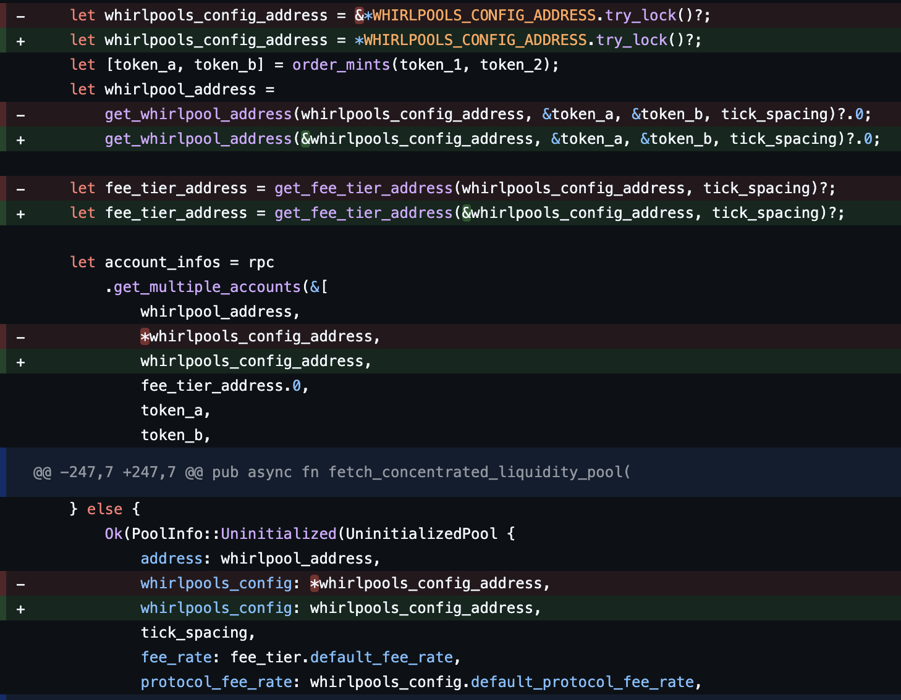

# Orca Whirlpools SDK - Mutex Send Issue Reproduction

## Problem

The SDK uses `std::sync::Mutex` for global configuration:
```rust
pub static WHIRLPOOLS_CONFIG_ADDRESS: Mutex<Pubkey> = Mutex::new(...);
```

When methods like `fetch_whirlpools_by_token_pair` are called inside `tokio::spawn`, it fails because `MutexGuard` doesn't implement `Send`, preventing the async task from being sent between threads.

## Error

```
error[E0277]: `std::sync::MutexGuard<'_, Pubkey>` cannot be sent between threads safely
```

## Reproduction

### Testing the Broken Version (Official SDK)

1. Edit `src/main.rs`:
   ```rust
   // Comment out line 3
   // use fixed_orca_whirlpools::{...};
   
   // Uncomment line 4
   use original_orca_whirlpools::{...};
   ```

2. Run:
   ```bash
   cargo check
   ```

3. You'll see the `Send` trait error.

### Testing the Working Version (Reference overalive Fixed)

1. Edit `src/main.rs`:
   ```rust
   // Use line 3 (default)
   use fixed_orca_whirlpools::{...};
   
   // Comment line 4
   // use original_orca_whirlpools::{...};
   ```

2. Run:
   ```bash
   cargo run
   ```

3. It compiles and runs successfully.

## The Fix

In `rust-sdk/whirlpool/src/`, change:




## What was the issue?

Mutexguard for `WHIRLPOOLS_CONFIG_ADDRESS` is alive over after the .await contexts. It doesn't implements `Send` so that violates thread safety. 

## Related Issue

See the discussion in the Orca Discord for more context.

## NEXT STEP
Basically, I notice operations for `WHIRLPOOLS_CONFIG_ADDRESS` are read-intensive overall.
So, I think changing `Mutex` type to `RwLock` will be helpful for tackling performance issue. Let me measure the performance metric!